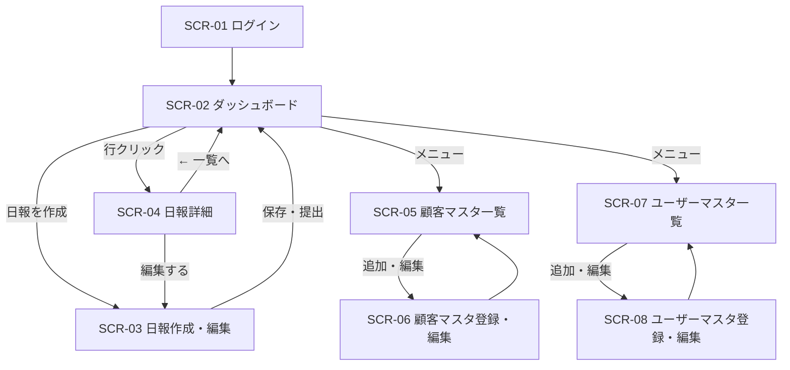

# 営業日報システム 画面定義書

## 画面一覧

| 画面ID | 画面名 | 対象ロール |
|---|---|---|
| SCR-01 | ログイン | 全員 |
| SCR-02 | ダッシュボード（日報一覧） | 全員 |
| SCR-03 | 日報作成・編集 | 営業 |
| SCR-04 | 日報詳細 | 全員 |
| SCR-05 | 顧客マスタ一覧 | 全員 |
| SCR-06 | 顧客マスタ登録・編集 | 管理者・上長 |
| SCR-07 | ユーザーマスタ一覧 | 管理者 |
| SCR-08 | ユーザーマスタ登録・編集 | 管理者 |

---

## SCR-01 ログイン

### 概要
システムへの認証画面。メールアドレスとパスワードでログインする。

### 画面レイアウト

```
┌─────────────────────────────┐
│        営業日報システム       │
│                             │
│  メールアドレス               │
│  [___________________________]│
│                             │
│  パスワード                  │
│  [___________________________]│
│                             │
│       [  ログイン  ]          │
└─────────────────────────────┘
```

### 入力項目

| 項目名 | 型 | 必須 | バリデーション |
|---|---|---|---|
| メールアドレス | text | ○ | メール形式 |
| パスワード | password | ○ | 8文字以上 |

### アクション

| 操作 | 処理 | 遷移先 |
|---|---|---|
| ログインボタン押下 | 認証処理 | SCR-02（成功時） |

---

## SCR-02 ダッシュボード（日報一覧）

### 概要
ログイン後のトップ画面。ロールによって表示内容が切り替わる。

- **営業**: 自分の日報一覧
- **上長**: 部下全員の日報一覧（未コメントのものを優先表示）

### 画面レイアウト

```
┌─────────────────────────────────────────────────┐
│ 営業日報システム          山田太郎(営業) [ログアウト] │
├─────────────────────────────────────────────────┤
│ 日報一覧                        [+ 日報を作成]   │
│                                                 │
│ 絞り込み: [年月 ▼]  [営業担当 ▼]  [ステータス ▼]  │
│                                                 │
│ ┌────────────────────────────────────────────┐  │
│ │ 日付       担当者    ステータス  コメント     │  │
│ ├────────────────────────────────────────────┤  │
│ │ 2026/04/01 山田太郎  提出済み   未コメント ● │  │
│ │ 2026/03/31 山田太郎  提出済み   コメント済み  │  │
│ │ 2026/03/28 鈴木花子  下書き     —            │  │
│ │ ...                                         │  │
│ └────────────────────────────────────────────┘  │
└─────────────────────────────────────────────────┘
```

### 表示項目（一覧行）

| 項目名 | 内容 |
|---|---|
| 日付 | 報告対象日 |
| 担当者 | 日報作成者名（上長ビューのみ表示） |
| ステータス | 下書き / 提出済み |
| コメント | 未コメント● / コメント済み / —（下書きは対象外） |

### アクション

| 操作 | 処理 | 遷移先 |
|---|---|---|
| 日報を作成ボタン | 当日分の日報作成 | SCR-03 |
| 一覧行クリック | 日報詳細表示 | SCR-04 |

### 表示制御

| ロール | 絞り込み「営業担当」 | 「日報を作成」ボタン |
|---|---|---|
| 営業 | 非表示（自分のみ） | 表示 |
| 上長 | 表示 | 非表示 |
| 管理者 | 表示 | 非表示 |

---

## SCR-03 日報作成・編集

### 概要
営業が日報を作成・編集する画面。訪問記録は動的に行を追加できる。

### 画面レイアウト

```
┌──────────────────────────────────────────────────┐
│ 日報作成              2026/04/01（今日）           │
├──────────────────────────────────────────────────┤
│                                                  │
│ ▼ 訪問記録                                        │
│ ┌──────────────────────────────────────────────┐ │
│ │  顧客名         訪問内容              訪問時刻  │ │
│ ├──────────────────────────────────────────────┤ │
│ │ [顧客を選択 ▼] [___________________] [HH:MM]  │ │
│ │ [顧客を選択 ▼] [___________________] [HH:MM]  │ │
│ │                              [+ 行を追加]     │ │
│ └──────────────────────────────────────────────┘ │
│                                                  │
│ ▼ 今の課題・相談 (problem)                        │
│ ┌──────────────────────────────────────────────┐ │
│ │                                              │ │
│ │                                              │ │
│ └──────────────────────────────────────────────┘ │
│                                                  │
│ ▼ 明日やること (plan)                             │
│ ┌──────────────────────────────────────────────┐ │
│ │                                              │ │
│ │                                              │ │
│ └──────────────────────────────────────────────┘ │
│                                                  │
│          [下書き保存]        [提出する]            │
└──────────────────────────────────────────────────┘
```

### 入力項目

#### 訪問記録（1行につき）

| 項目名 | 型 | 必須 | バリデーション |
|---|---|---|---|
| 顧客名 | select（顧客マスタ） | ○ | — |
| 訪問内容 | textarea | ○ | 最大1000文字 |
| 訪問時刻 | time | — | HH:MM形式 |

#### 課題・相談 / 明日の計画

| 項目名 | 型 | 必須 | バリデーション |
|---|---|---|---|
| 今の課題・相談 (problem) | textarea | — | 最大2000文字 |
| 明日やること (plan) | textarea | — | 最大2000文字 |

### アクション

| 操作 | 処理 | 遷移先 |
|---|---|---|
| 行を追加 | 訪問記録の入力行を1行追加 | — |
| 行削除（×） | 対象行を削除 | — |
| 下書き保存 | status=draft で保存 | SCR-02 |
| 提出する | バリデーション後 status=submitted で保存 | SCR-04 |

### バリデーション（提出時）

- 訪問記録が1行以上あること
- 各訪問記録の顧客名・訪問内容が入力されていること

---

## SCR-04 日報詳細

### 概要
日報の内容閲覧と、上長によるコメント投稿画面。

### 画面レイアウト

```
┌──────────────────────────────────────────────────┐
│ ← 一覧へ    日報詳細    山田太郎 / 2026/04/01      │
├──────────────────────────────────────────────────┤
│                                                  │
│ ▼ 訪問記録                                        │
│ ┌──────────────────────────────────────────────┐ │
│ │  顧客名          訪問内容              時刻   │ │
│ ├──────────────────────────────────────────────┤ │
│ │  株式会社ABC      新製品の提案を実施。先方…  10:00 │ │
│ │  有限会社XYZ      契約更新の確認。来週…    14:30 │ │
│ └──────────────────────────────────────────────┘ │
│                                                  │
│ ▼ 今の課題・相談 (problem)                        │
│ ┌──────────────────────────────────────────────┐ │
│ │ ABC社の担当者が来月異動予定。引き継ぎ先の…      │ │
│ └──────────────────────────────────────────────┘ │
│  💬 コメント                                      │
│  [田中部長] 来週の会議で共有してください。(04/01 18:00) │
│  ┌──────────────────────────────────┐           │
│  │ コメントを入力...                 │ [送信]    │
│  └──────────────────────────────────┘           │
│                                                  │
│ ▼ 明日やること (plan)                             │
│ ┌──────────────────────────────────────────────┐ │
│ │ ・ABC社へのフォローアップ連絡                   │ │
│ │ ・提案書の修正                                 │ │
│ └──────────────────────────────────────────────┘ │
│  💬 コメント                                      │
│  （コメントなし）                                 │
│  ┌──────────────────────────────────┐           │
│  │ コメントを入力...                 │ [送信]    │
│  └──────────────────────────────────┘           │
│                                                  │
│                          [編集する]（下書きのみ）  │
└──────────────────────────────────────────────────┘
```

### 表示項目

| 項目名 | 内容 |
|---|---|
| 訪問記録 | 顧客名・訪問内容・時刻の一覧 |
| problem | 今の課題・相談のテキスト |
| plan | 明日やることのテキスト |
| コメント | 各セクションへの上長コメント（投稿者名・日時付き） |

### コメント入力

| 項目名 | 型 | 必須 | バリデーション |
|---|---|---|---|
| コメント | textarea | ○ | 最大1000文字 |

### アクション

| 操作 | 処理 | 遷移先 |
|---|---|---|
| コメント送信 | コメント保存（target_type: problem/plan） | — (画面更新) |
| 編集する | 日報編集画面へ | SCR-03 |
| ← 一覧へ | 日報一覧へ戻る | SCR-02 |

### 表示制御

| ロール | コメント入力欄 | 編集ボタン |
|---|---|---|
| 営業（本人） | 非表示 | 下書きのみ表示 |
| 上長 | 表示 | 非表示 |
| 管理者 | 非表示 | 非表示 |

---

## SCR-05 顧客マスタ一覧

### 概要
登録済み顧客の一覧・検索画面。

### 画面レイアウト

```
┌──────────────────────────────────────────────────┐
│ 顧客マスタ                          [+ 顧客を追加]  │
│                                                  │
│ [検索キーワード________________] [検索]            │
│                                                  │
│ ┌──────────────────────────────────────────────┐ │
│ │  顧客名       会社名          電話番号   操作  │ │
│ ├──────────────────────────────────────────────┤ │
│ │  山田 一郎   株式会社ABC    03-XXXX-XXXX  [編集]│ │
│ │  鈴木 次郎   有限会社XYZ    06-XXXX-XXXX  [編集]│ │
│ └──────────────────────────────────────────────┘ │
└──────────────────────────────────────────────────┘
```

### 検索項目

| 項目名 | 検索対象カラム |
|---|---|
| キーワード | 顧客名・会社名（部分一致） |

### アクション

| 操作 | 処理 | 遷移先 |
|---|---|---|
| 顧客を追加 | — | SCR-06（新規） |
| 編集 | — | SCR-06（編集） |

### 表示制御

| ロール | 追加ボタン | 編集ボタン |
|---|---|---|
| 営業 | 非表示 | 非表示 |
| 上長・管理者 | 表示 | 表示 |

---

## SCR-06 顧客マスタ登録・編集

### 概要
顧客情報の登録・編集フォーム。上長・管理者のみ操作可能。

### 入力項目

| 項目名 | 型 | 必須 | バリデーション |
|---|---|---|---|
| 顧客名 | text | ○ | 最大100文字 |
| 会社名 | text | ○ | 最大200文字 |
| 電話番号 | text | — | 数字・ハイフン |
| メールアドレス | text | — | メール形式 |
| 住所 | textarea | — | 最大500文字 |

### アクション

| 操作 | 処理 | 遷移先 |
|---|---|---|
| 保存 | バリデーション後 INSERT/UPDATE | SCR-05 |
| キャンセル | 変更を破棄 | SCR-05 |

---

## SCR-07 ユーザーマスタ一覧

### 概要
登録ユーザーの一覧・管理画面。管理者のみアクセス可能。

### 表示項目

| 項目名 | 内容 |
|---|---|
| 氏名 | ユーザー名 |
| メールアドレス | ログインID |
| ロール | 営業 / 上長 / 管理者 |
| 部署 | 所属部署名 |

### アクション

| 操作 | 遷移先 |
|---|---|
| ユーザーを追加 | SCR-08（新規） |
| 編集 | SCR-08（編集） |

---

## SCR-08 ユーザーマスタ登録・編集

### 概要
ユーザー情報の登録・編集フォーム。管理者のみ操作可能。

### 入力項目

| 項目名 | 型 | 必須 | バリデーション |
|---|---|---|---|
| 氏名 | text | ○ | 最大100文字 |
| メールアドレス | text | ○ | メール形式・重複不可 |
| パスワード | password | ○（新規のみ） | 8文字以上 |
| ロール | select | ○ | 営業 / 上長 / 管理者 |
| 部署 | select | ○ | 部署マスタから選択 |

### アクション

| 操作 | 処理 | 遷移先 |
|---|---|---|
| 保存 | バリデーション後 INSERT/UPDATE | SCR-07 |
| キャンセル | 変更を破棄 | SCR-07 |

---

## 画面遷移図


